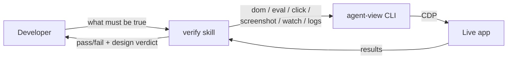

<div align="center">
    
    <h1>agent-view</h1>
    <p><b>DevTools-level access for AI agents. Electron, Tauri, Chromium.</b></p>
</div>

<p align="center">
    <a href="https://www.npmjs.com/package/@petukhovart/agent-view"></a>
    <a href="https://www.npmjs.com/package/@petukhovart/agent-view"></a>
    <a href="https://www.npmjs.com/package/@petukhovart/agent-view"></a>
    <a href="https://github.com/PetukhovArt/agent-view/blob/main/LICENSE"></a>
    <a href="https://nodejs.org"></a>
    <a href="https://github.com/PetukhovArt/agent-view/stargazers"></a>
</p>

<p align="center">
    <a href="#quickstart-claude-code">Quickstart</a> ·
    <a href="#features">Features</a> ·
    <a href="#commands">Commands</a> ·
    <a href="#workflow-with-claude-code">Workflow</a> ·
    <a href="CHANGELOG.md">Changelog</a>
</p>

> Agents can read your code and your tests. What they can't see: whether the button is actually disabled, whether the modal opened, whether the store mutated. **agent-view** is one CLI that talks to your Electron, Tauri, or Chromium app over Chrome DevTools Protocol so the agent can answer those questions itself.

Works with any agent that can run shell commands. There's a Claude Code plugin if you want the smoothest path.

---

## Why agent-view

- Reads state inside `SharedWorker`, `ServiceWorker`, and dedicated workers. Half of a modern app's state lives there, and most browser-automation tools don't follow it.
- Every command takes `--window <id>`. Settings, tray, and detached windows in Electron and Tauri apps work the same as the main window.
- Electron, Tauri on Windows (WebView2), and plain Chromium. One CLI, same commands. Tauri on macOS/Linux embeds WebKit, which has no Chrome DevTools Protocol, so it is out of reach.
- `click`, `fill`, and `drag` fire real CDP input events. Vue `v-model`, React controlled inputs, and native fields actually accept the value; synthetic DOM events fail silently there.
- `watch` emits RFC-6902 JSON-patches of any JS expression between two events. Answers "what mutated after the click?" without parsing screenshots.
- `dom` returns the accessibility tree with `[ref=N]` handles. `--compact` cuts deep trees by 40–60%; `--diff`, `--count`, and `--max-lines` keep output bounded. `screenshot --crop` and WebP scaling do the same for vision tokens.
- Lazy CDP daemon, one persistent socket, 300 ms AX-tree cache. `dom → click → dom` in about 17 ms.

---

## Quickstart (Claude Code)

> Using Cursor / Aider / Cline / CI? Jump to [Other agents](#using-agent-view-with-other-agents-cursor-aider-cline-copilot-ci).

**1. Install the CLI and create a config:**

```bash
npm install -g @petukhovart/agent-view   # one-time, global
cd your-project
agent-view init                          # writes agent-view.config.json (runtime, port, launch script)
```

`init` auto-detects most projects. Review the generated `launch` field if your dev command is non-standard, and set `"allowEval": true` if you want verification to use `eval`/`watch`. Prefer to write the config by hand? See [Config](#config) for the field list.

**2. Install the Claude Code plugin** (adds the `verify` skill):

```text
/plugin marketplace add PetukhovArt/agent-view
/plugin install agent-view@agent-view
```

**3. Open a CDP debug port** in your app, matching the `port` in your config. Pick your runtime:

<details open>
<summary><b>Electron</b> — top of <code>main.ts</code>, before <code>app.whenReady()</code></summary>

```js
import { app } from 'electron';
if (!app.isPackaged) {
  app.commandLine.appendSwitch('remote-debugging-port', '9876');
}
```
</details>

<details>
<summary><b>Tauri 2</b> (WebView2 / Windows) — env var passed to <code>tauri dev</code></summary>

In `package.json`, wrap the dev script with [`cross-env`](https://www.npmjs.com/package/cross-env) so it works on Windows, macOS and Linux shells:

```json
{
  "scripts": {
    "dev": "cross-env WEBVIEW2_ADDITIONAL_BROWSER_ARGUMENTS=--remote-debugging-port=9876 tauri dev"
  }
}
```

Then `npm run dev` as usual. Devtools must be enabled in `tauri.conf.json` (default in `tauri dev`; for release builds, enable the `devtools` Cargo feature). Windows only: on macOS/Linux Tauri embeds WebKit, which speaks the WebKit Remote Inspector protocol, not CDP, so agent-view cannot attach there.
</details>

<details>
<summary><b>Plain Chromium app</b> — launch flag</summary>

```bash
chromium --remote-debugging-port=9876
```
</details>

**4. In Claude Code, describe what you want verified:**

```text
Verify: after clicking Save, the button must be disabled until network completes.
No console errors.
```

The `verify` skill starts your app via `agent-view launch`, runs the cheapest checks first (`eval` before `dom` before `screenshot`), and reports pass/fail. See [Workflow with Claude Code](#workflow-with-claude-code) for driving it from a plan or a diff.

---

## Manual CLI usage

When you want to drive the CLI yourself (other agents, CI, or just to poke around):

```bash
agent-view init                      # writes agent-view.config.json; auto-detects runtime/port/launch
agent-view launch                    # starts the app, waits for CDP, idempotent
agent-view dom --filter "Submit"     # AX tree, with [ref=N] handles
agent-view click 12                  # use a ref from the dom output
agent-view eval "store.state.user"   # requires allowEval
```

Full command surface in [Commands](#commands). For non-Claude-Code agents, see also [Other agents](#using-agent-view-with-other-agents-cursor-aider-cline-copilot-ci).

---

## How it works

```
┌──────────────┐    JSON over TCP        ┌─────────────────┐                 ┌──────────────┐
│  agent-view  │  (token-auth, local)    │  Lazy daemon    │      CDP        │   Your app   │
│     CLI      │ ──────────────────────▶ │  127.0.0.1:47922│ ──────────────▶ │  (Electron / │
│              │                         │                 │   WebSocket     │   Tauri /    │
│  one shot    │ ◀────────────────────── │  cache + reuse  │ ◀────────────── │   Chromium)  │
└──────────────┘    compact text         └─────────────────┘                 └──────────────┘
                                           ▲   spawned on first call
                                           │   shuts down after 5 min idle
                                           │   reuses one CDP socket across commands
```

The daemon is why `dom → click → dom` runs in ~17ms total: one persistent CDP socket, a 300ms AX-tree cache, parallel CDP calls inside `click`. CLI commands themselves are stateless. Each one is a single shell call you can drop into a script.

---

## Features

| Command       | What it gives the agent                                                                |
|---------------|-----------------------------------------------------------------------------------------|
| `dom`         | Accessibility tree with `[ref=N]` handles. Flags: `--filter`, `--compact`, `--count`, `--max-lines`, `--diff`. |
| `screenshot`  | PNG, or scaled WebP, or `--crop <element>` for one element only. Cuts vision tokens.    |
| `click` / `fill` / `drag` | Real CDP input events. Works with Vue/React/native; `drag` does HTML5 DnD through `Input.dragIntercepted` and pointer DnD through mouse events. |
| `eval`        | Run JS in the page's main world. Read store/state directly instead of scraping DOM.     |
| `watch`       | Stream JSON-patch diffs of any expression. Answers "what changed between click and final state?". |
| `console`     | `console.log` + `Log.entryAdded` per page **and per worker**, with `--follow --until <pattern>`. |
| `logs`        | Durable file feed of page + worker console, surviving reloads and worker restarts. `tail --grep/--since/--level`, `clear`, plus re-injecting `--probe` scripts. |
| `network`     | Request/response timeline, headers, timing, bodies, and WebSocket/SSE frames. Filters: `--url`, `--method`, `--status`, `--type`. Captures page-load traffic. |
| `coverage`    | Which functions ran since the last `--clear`. Turns "does any action reach this code?" into a positive answer. Filters: `--filter`, `--file`, `--count`. |
| `listeners`   | Event handlers bound to a node, each with the `file:line` it was declared at.            |
| `heap`        | Named heap snapshots diffed by class: what grew after repeating an action, how many are detached DOM nodes, and what retains them. |
| `upload`      | Puts files into a file input — no picker opens. `--selector` reaches the hidden inputs that have no ref. |
| `dialog`      | JS modals are answered automatically so they cannot freeze the run; sets the answer, and pre-answers native file pickers with `arm`. |
| `wait`        | Block until an element appears (default 10s).                                            |
| `scene`       | WebGL scene graph (PixiJS today, engine-pluggable). `--compact` and `--diff` mirror `dom`. |
| `snap`        | DOM + scene + optional screenshot in one call.                                           |
| `targets`     | Enumerate pages, iframes, shared/service/dedicated workers.                              |
| `discover` / `launch` / `init` / `stop` | Lifecycle and setup.                                          |

Full flag reference in [Commands](#commands).

---

## Workflow with Claude Code

The plugin adds the `verify` skill: it launches the app, picks the cheapest tool that can answer each question (`eval` before `dom` before `screenshot`), executes the checks against the live app, and reports pass / fail / requires-visual-review per step.



### Ad-hoc

```text
Verify: after clicking Save, the button must be disabled until network completes. No console errors.
```

### From a plan or a diff

```text
Verify the scenarios in .claude/plans/2026-04-27-login-redirect.md for commits <hash1>..<hash2>.
Symptom: after login, redirect went to /home instead of /dashboard.

Design references (optional):
- /abs/path/figma-exports/post-login.png   → "post-login dashboard"
```

When something fails:

```text
Step 4 failed (zone filter not mutating store). Fix and re-run that step plus step 7.
```

### Anti-patterns

- "Just verify the feature" with no symptom. Without knowing what "works" means, the skill can't pick the cheapest signal.
- Pasting Figma URLs. agent-view doesn't fetch from Figma; export to PNG and pass the local path.
- 50 assertions in one run. Split per-feature; a verification pass should finish in under 2 minutes.

---

## Using agent-view with other agents (Cursor, Aider, Cline, Copilot, CI)

The CLI is the whole product. Any agent that can run shell commands can use it:

```bash
agent-view discover                  # JSON: window IDs, titles, URLs
agent-view dom --filter "Submit"     # AX tree, with refs
agent-view fill 3 "hello@example.com"
agent-view click 7
agent-view eval "store.state.user.role"
agent-view screenshot --crop "Sidebar" --scale 0.5
```

For agents that benefit from a system-prompt shim, copy the gist of [`skills/verify/SKILL.md`](skills/verify/SKILL.md) into your agent's instructions. The DOM-first workflow and tool-selection table are framework-agnostic.

---

## Enabling CDP

agent-view talks to your app over Chrome DevTools Protocol. Your app must be launched with a debugging port open.

### Recommended: in code (reliable, works with any build tool)

Add to your Electron main process, **before `app.whenReady()`** (top of `main.ts`/`main.js`, right after the `electron` import; switches set after the app is ready are ignored):

```js
import { app } from 'electron';

app.commandLine.appendSwitch('remote-debugging-port', '9876');
```

> Any free port works; `9876` is just an example. Avoid `9222` (Chrome's own default remote-debugging port) to prevent collisions when Chrome is open.

**Production safety:** an open CDP port in a signed/notarized build is a remote-code-execution surface. Gate it on `!app.isPackaged` so it only opens in dev:

```js
if (!app.isPackaged) {
    app.commandLine.appendSwitch('remote-debugging-port', '9876');
}
```

### Alternative: via CLI flag (no code changes)

```bash
# Plain Electron
electron . --remote-debugging-port=9876

# electron-vite (note the -- to forward the flag past the build tool)
npx electron-vite dev -- --remote-debugging-port=9876
```

### Other runtimes

| Runtime              | Setup                                      |
|----------------------|--------------------------------------------|
| **Tauri (Windows)**  | `WEBVIEW2_ADDITIONAL_BROWSER_ARGUMENTS`, see above. WebKit builds (macOS/Linux) are not supported |
| **Any Chromium app** | `--remote-debugging-port=9876` launch flag |

### Verify CDP is working

```bash
curl -s http://localhost:9876/json/version
```

A JSON response with process info means CDP is reachable.

---

## Config

Running `agent-view init` in your project root generates `agent-view.config.json`. Every other command locates it by walking up from the current directory (like git looks for `.git`), so commands work from any subdirectory of the project; the config's directory is what `launch` uses as the app's working directory.

Minimal form:

```json
{
  "runtime": "electron",
  "port": 9876,
  "launch": "npm run dev"
}
```

Full form with all optional fields:

```json
{
  "runtime": "electron",
  "port": 9876,
  "launch": "npm run dev",
  "allowEval": true,
  "webgl": {
    "engine": "pixi"
  },
  "consoleBufferSize": 500,
  "consoleTargets": ["page", "shared_worker", "service_worker"],
  "captureBody": false,
  "networkBufferSize": 200,
  "logFile": ".agent-view/console.log",
  "logMaxBytes": 8388608
}
```

| Field               | Required | Description                                                                                                                                           |
|---------------------|----------|-------------------------------------------------------------------------------------------------------------------------------------------------------|
| `runtime`           | yes      | `"electron"`, `"tauri"`, or `"browser"`                                                                                                               |
| `port`              | yes      | CDP debugging port. Integer in range `1`–`65535`                                                                                                      |
| `launch`            | yes      | Shell command used by `agent-view launch` to start the app (e.g. `"npm run dev"`). Pass an empty string if you always start the app yourself          |
| `webgl.engine`      | no       | Scene-graph engine. Currently `"pixi"` ships an adapter; the architecture is pluggable for adding more engines                                        |
| `allowEval`         | no       | `true` to enable `agent-view eval` and `watch`. Off by default; opt-in for arbitrary JS execution                                                     |
| `consoleBufferSize` | no       | Per-target console ring capacity. Positive integer. Default `500`                                                                                     |
| `consoleTargets`    | no       | Target types `agent-view console` auto-attaches to on first call. Any subset of `["page", "iframe", "shared_worker", "service_worker", "worker"]`. Default `["page", "shared_worker", "service_worker"]` |
| `captureBody`       | no       | `true` to capture response bodies and request payloads for `agent-view network`. Off by default; opt-in since bodies can carry tokens/PII. WebSocket frame payloads are visible regardless              |
| `networkBufferSize` | no       | Per-target network ring capacity. Positive integer. Default `200` (smaller than console — entries are heavier)                                                                                         |
| `logFile`           | no       | Feed file for `agent-view logs`. Relative paths resolve against the project root. Default `.agent-view/console.log` (gitignore it). Keep it per-checkout: two ports recording into one file is refused                                                                     |
| `logMaxBytes`       | no       | Feed size cap in bytes; on overflow it rotates once to `<file>.prev`. Default `8388608` (8 MB)                                                                                                         |

---

## Commands

Every command targeting a window accepts `--window <id|title-substring>` (IDs come from `discover`). Examples below omit it for brevity.

### `init`

Auto-generates config by reading `package.json`.

### `discover`

Lists running app windows as JSON: window IDs, titles, URLs.

```bash
agent-view discover
```

### `dom`

Dumps the accessibility tree in compact text format. Each element gets a session ref ID for interaction.

```bash
agent-view dom
agent-view dom --filter "Submit"    # Filter by text/role
agent-view dom --depth 3            # Limit tree depth
agent-view dom --max-lines 200      # Hard line budget (refs for hidden nodes still stored)
agent-view dom --text               # Fall back to DOM textContent search when AX returns no match
agent-view dom --compact            # Merge single-child chains onto one line (saves ~40-60% tokens)
agent-view dom --count              # Return only the count of matching nodes (e.g. "5")
agent-view dom --filter "row" --count  # Count how many rows match
agent-view dom --diff               # Show only lines that changed since last call
```

When `--filter` is set, depth defaults to unlimited so deep matches aren't truncated.

`--count` skips tree formatting and ref-store mutations entirely; useful for assertions like "does this section have N rows?" without the token cost of a full tree dump.

`--max-lines <n>` caps the number of output lines. When the tree exceeds the budget, output is truncated after `n-1` lines and a summary tail `… M more nodes` is appended. Refs for all nodes, including those past the cutoff, are still registered in the ref store, so a follow-up `dom --filter` or `click <ref>` works without re-running.

`--diff` computes a line-level diff against the previous `dom` call for the same target. The first call always returns the full tree (no prior snapshot). Subsequent calls emit only added (`+ `) and removed (`- `) lines. Returns `No changes` when the tree is identical.

### `click`

Clicks a DOM element by ref ID or coordinates.

```bash
agent-view click 5                  # By ref from dom output
agent-view click --pos 100,200      # By coordinates (for canvas)
agent-view click 5 --double         # Double-click (fires dblclick handlers)
agent-view click 5 --right          # Right-click (fires contextmenu)
```

### `fill`

Types text into an input. Uses native value setter + dispatches input/change events (works with Vue, React, and other frameworks).

```bash
agent-view fill 3 "hello@example.com"
```

### `drag`

Drag-and-drop over CDP. Two paths, picked automatically:

- **HTML5** (`draggable=true`, `dragstart`/`dragover`/`drop`). Plain mouse events never start one in Chromium: `dragstart` does not fire, `dataTransfer` stays empty, `drop` never arrives. So `drag` enables `Input.setInterceptDrags`, presses and moves, and when Chromium reports `Input.dragIntercepted` it finishes the gesture with `Input.dispatchDragEvent` (`dragEnter` → N × `dragOver` → `drop`), carrying the app's real `dataTransfer` payload. The same mechanism Puppeteer uses.
- **Pointer** (`mousedown`/`mousemove`/`mouseup`, pointer events). Used when no `dragIntercepted` arrives within 1 s: `vue-draggable-resizable`, `react-grid-layout`, gridstack, canvas, resize handles.

```bash
agent-view drag --from 42 --to 88                   # ref → ref
agent-view drag --from-pos 86,792 --to-pos 640,200  # coord → coord (canvas, custom DnD)
agent-view drag --from 42 --to-pos 640,200          # mixed
agent-view drag --from 5 --to 9 --steps 20 --hold-ms 150
agent-view drag --from-pos 385,303 --to-pos 1250,589 --cancel   # HTML5: dragCancel instead of drop (Esc mid-drag)
agent-view drag --from-pos 385,303 --to-pos 1250,589 --html5    # fail instead of falling back to pointer
agent-view drag --from-pos 385,303 --to-pos 1250,589 --pointer  # never intercept
```

The output names the path and, for HTML5, the intercepted MIME types and data — check that the payload is the app's (`application/json`, a custom type), not a text selection:

```
Dragged (385, 303) → (1250, 589) via html5 drop (dragOperationsMask=3)
  text/plain: "1:hr:4100@UInt16"
  application/json: "[{\"id\":\"1:hr:4100@UInt16\",\"name\":\"Float HiLo\",...}]"
```

```
Dragged (485, 140) → (1250, 589) via pointer
  warning: no HTML5 drag started (Input.dragIntercepted not fired within 1 s): the element at --from is not draggable, or a control (input/select/button) under the cursor swallowed dragstart
```

Pitfalls of the HTML5 path: start on a cell without a control — an `<input>`, `<select>` or `<button>` under the cursor swallows `dragstart` even inside a `draggable` row; Chromium needs several `mouseMoved` past its drag threshold, so `--steps 0` will not start one. `--mask <n>` overrides `dragOperationsMask` on the dispatched events — diagnostics for `effectAllowed` / `dropEffect` mismatches, which the browser enforces only on a real drag.

`--steps` (default 10) controls intermediate `mouseMoved` / `dragOver` events so libraries that throttle on movement deltas still see continuous motion. `--hold-ms` inserts a pause between press and the first move (some libs require >100ms for touch-style activation). `--button` accepts `left|right|middle`.

### `upload`

Puts files into a file input through CDP `DOM.setFileInputFiles`. No picker opens, so there is nothing to arm and nothing to close.

```bash
agent-view upload --selector "#file-input" --file ./fixtures/a.png
agent-view upload --selector "#images" --file ./a.png --file ./b.png   # multi-select input
agent-view upload --ref 12 --file ./a.png
```

`--selector` is the flag you will usually want: upload inputs are almost always hidden (`display:none`, `class="d-none"`, `v-show="false"`) and clicked from code, which keeps them out of the accessibility tree — so `dom` never prints a `[ref=N]` for them. There is deliberately no `--filter`: an accessible name resolves to the label or the button carrying it, not to the `<input type=file>` behind it. Paths resolve against the current directory and must be real files; CDP accepts a missing path or a directory without complaint and the app then reads an empty file.

### `dialog`

Everything modal. JS modals are answered automatically — this command is how you change that answer, inspect what happened, and pre-answer native file pickers.

```bash
agent-view dialog                            # standing answer + log of modals and pickers
agent-view dialog policy accept              # confirm() → true from now on
agent-view dialog policy accept --text "hi"  # prompt() → "hi"
agent-view dialog policy dismiss             # back to the default
agent-view dialog accept | dismiss           # answer the one open right now
agent-view dialog arm --file ./a.png         # pre-answer the next native file picker
agent-view dialog arm --cancel               # …as if the user pressed Cancel
agent-view dialog disarm                     # let real pickers open again
```

**JS modals.** `connectToPage` enables the CDP `Page` domain, and Chromium then stops showing `alert`/`confirm`/`prompt`/`beforeunload` natively — it blocks the renderer until the client answers. Every page session therefore answers on its own; the default is dismiss. `beforeunload` is always dismissed regardless of the policy: accepting it would navigate away mid-run and lose the state under inspection. Each one is written to the console feed as `[agent-view] confirm auto-dismissed: <message>`, which is how you explain a `confirm()` that returned `false` for no visible reason. `dialog accept` / `dialog dismiss` handle the one case the policy cannot: a modal that was already open before agent-view attached, which produced no event.

**Native file pickers.** `dialog arm` holds an answer ready so the picker never opens, and arms two engines at once — CDP file-chooser interception for webview pickers, and a `window.__TAURI_INTERNALS__.invoke` shim for `@tauri-apps/plugin-dialog`, whose dialog runs in Rust past the webview where CDP cannot reach it. Use it for the input that is created and removed inside the click handler; a selector cannot address that one. Otherwise prefer `upload`.

Two rules that bite:

- **Arm before the click.** A picker cannot be caught once open. The arm is one-shot: the first picker spends it and interception turns itself off, so a later click opens a real OS dialog.
- **Click with `agent-view click`, not `eval "el.click()"`.** Chromium refuses to open a file picker without user activation, and an eval-driven click has none — the picker is silently dropped and never intercepted.

Out of reach: `showOpenFilePicker()` (File System Access API) exposes no input to fill and can only be cancelled; Electron does not implement `window.prompt`; a native dialog opened from an Electron **main** process is invisible to CDP.

### `screenshot`

Captures a screenshot, saves to temp dir, prints the file path. PNG by default; WebP (q=80) when `--scale` is set (JPEG fallback for older Chrome/Electron).

```bash
agent-view screenshot
agent-view screenshot --scale 0.5             # Half-res WebP (~3× fewer vision tokens)
agent-view screenshot --scale 0.25            # Quarter-res WebP (~12× fewer, 1 tile)
agent-view screenshot --crop "Sidebar"        # Crop to element bounding box (~12× fewer in best case)
agent-view screenshot --crop "Chart" --scale 0.5  # Crop + scale (stacks)
agent-view screenshot --crop "Active bookings" --crop-up 1  # Crop the card, not its heading
```

`--scale` accepts a factor in `(0, 1]`. CDP-side clip + WebP encode; recommended for agent loops where vision tokens dominate cost.

`--crop <filter>` resolves a DOM element by the same filter syntax as `dom --filter`, then crops the screenshot to its bounding box before encoding. One tile (~1.6k vision tokens) instead of twelve (~19k) in the best case. If the filter matches nothing a warning is emitted to stderr and the full window is captured instead. Combines naturally with `--scale`.

A text filter matches the text-bearing node, so cropping on a section title yields a thin strip of that title; `--crop-up <n>` climbs `n` element ancestors first (`1` usually gets the surrounding card). A text-sized crop is reported on stderr.

### `scene`

Reads the WebGL scene graph for canvas-based apps. Currently supports PixiJS via `window.__PIXI_DEVTOOLS__`.

```bash
agent-view scene                    # Full scene graph
agent-view scene --diff             # Changes since last call
agent-view scene --filter "player"  # Filter by name/type
agent-view scene --verbose          # Extended props (alpha, scale, bounds)
agent-view scene --compact          # Merge single-child chains onto one line
```

### `snap`

Combined DOM + scene graph in one call. Shows DOM always; scene section appears when a WebGL engine is detected. Pass `--scale` to also capture a screenshot and append it as a third section.

```bash
agent-view snap
agent-view snap --scale 0.5   # DOM + Scene + Screenshot (path written to tmp)
```

### `wait`

Waits for a DOM element matching the filter to appear. Useful after navigation or async operations.

```bash
agent-view wait --filter "Dashboard"              # Wait for element (default 10s)
agent-view wait --filter "Dashboard" --timeout 30 # Custom timeout in seconds
```

### `launch`

Starts the app using the `launch` command from config. Polls CDP until ready (60s timeout). Idempotent; skips if already running.

### `targets`

Lists every CDP target: pages, iframes, shared/service/dedicated workers. Use this when you need access to non-page targets (e.g. an Electron app with a `SharedWorker`).

```bash
agent-view targets                                       # all supported types
agent-view targets --type shared_worker,service_worker   # filter
agent-view targets --json                                # machine-readable
```

### `eval`

Runs `Runtime.evaluate` in any connectable target. **Requires `"allowEval": true` in `agent-view.config.json`**; the local socket is shared and this is the project-owner opt-in.

```bash
agent-view eval "document.title"
agent-view eval --target IJ56KL "self.constructor.name"           # by id (or title/url substring)
agent-view eval --window "Monitor 1" --await "fetch('/api/health').then(r => r.status)"
agent-view eval --json "({ buttons: document.querySelectorAll('button').length })"
```

Output is capped at 64 KB. Thrown exceptions and syntax errors propagate as non-zero exit with the CDP error message.

> **Note on execution context.** `agent-view eval` runs in the page's **main world** via `Runtime.evaluate`. Only values reachable from the main-world `window` are visible. To expose your API for `eval` (and `watch`), attach it to `window`:
> - Vanilla / browser: `window.myApi = { ... }`
> - Electron preload with `contextIsolation: true`: `contextBridge.exposeInMainWorld('myApi', { ... })`
> - Tauri / WebView2: same; assign to `window` from your bootstrap script
>
> Anything kept inside an isolated-world preload without `contextBridge` will be invisible to `eval`; `eval "typeof window.myApi"` will return `"undefined"` even though the value exists in the preload context.

### `console`

Streams or dumps console output (`Runtime.consoleAPICalled` + `Log.entryAdded`) from auto-attached targets. Lazy: first call attaches matching targets, subsequent calls reuse them.

```bash
agent-view console                              # buffered messages since attach
agent-view console --follow --timeout 10        # stream for 10s
agent-view console --follow --until "ready"     # exit as soon as a message contains "ready"
agent-view console --follow --until "/error/i"  # exit on regex match (case-insensitive)
agent-view console --target IJ56KL              # restrict to one target (exact id)
agent-view console --target sync-worker         # restrict to one target (title/URL substring)
agent-view console --level error,warn           # level filter
agent-view console --since "2026-04-26T10:00:00Z"
agent-view console --clear                      # drop in-memory ring
```

`--until <pattern>` requires `--follow`. Exits as soon as a message matches the pattern (substring or `/regex/flags`). On timeout without match exits non-zero with `Timeout: pattern not seen in <N>s`.

`--target` resolves the same way as `eval --target`: exact id wins, then a case-insensitive id prefix of at least 4 chars (the 8-char handle `targets` prints), then title substring, then URL substring. An ambiguous id prefix is reported as ambiguous rather than resolved; if nothing matches, an error is returned.

Default attached target types: `page`, `shared_worker`, `service_worker`. Override with `consoleTargets` in config.

### `logs`

Records the console output of every attached target into one file and queries it. `console` answers from an in-memory ring that dies with the server; `logs` gives a durable timeline that outlives reloads, worker restarts and the 5-min idle shutdown — the tool for intermittent bugs and long scenarios.

```bash
agent-view logs start --truncate            # record from empty; suspends idle shutdown
agent-view logs                             # tail last 200 records (default subcommand)
agent-view logs tail -n 50 --level error,warn
agent-view logs tail --grep "ws closed"     # substring or /regex/flags
agent-view logs tail --since -2m            # -30s | -5m | -2h | 09:31 | 09:31:02.500 | ISO
agent-view logs status                      # attached targets, feed size, rescan ticks
agent-view logs clear                       # truncate feed + drop console ring (baseline)
agent-view logs stop
```

Feed format is one record per physical line — `HH:MM:SS.mmm [level] [type:id8] text`, local clock, newlines inside a message escaped to `\n`, records capped at 4000 chars. Line-oriented tools (`grep`, `awk`, `--since`) therefore never trip over a wrapped stack trace or JSON payload.

While recording, targets are re-discovered every 3s (`--rescan <ms>`), so a SharedWorker that restarts under a new id rejoins the feed on its own. Default file `.agent-view/console.log` under the project root (`logFile` in config, or `--file`); at `logMaxBytes` (8 MB) it rotates once to `<file>.prev`. `--target` records a single target, `--level` filters at write time.

`--probe <file.js>[@target]` injects JS into matching targets and re-injects it whenever the context is gone (page reload, worker restart), so a probe keeps reporting for the whole run. Probes report through plain `console.log`, which lands in the feed like any other message. **Requires `"allowEval": true`** — it is arbitrary JS. The `@target` suffix filters by type/id-prefix/title/URL substring.

```bash
agent-view logs start --probe ./probes/orchestrator.js@shared_worker
```

### `network`

Lists captured network requests, one compact line each with a short `[req=N]` handle. Expand one with `--req N` for headers, timing, body, or the WebSocket frame log. Surfaces the silent failures DOM and console can't: a 404 that never throws, a CORS block, a missing `Authorization` header, a realtime socket that never receives its message.

```bash
agent-view network                              # recent requests, newest at the bottom
agent-view network --req 3                       # expand one: headers, timing, body / WS frames
agent-view network --status 4xx,5xx,failed       # class, exact code (404), or `failed` (no HTTP response — CORS/conn refused)
agent-view network --method POST                 # find mutations among reads
agent-view network --type xhr,fetch              # drop document/image/font noise
agent-view network --url "*/api/users*"          # URL substring, or glob with *
agent-view network --follow --until "/api/save"  # stream until a matching request fires
agent-view network --raw-headers --req 3         # reveal redacted header values
agent-view network --clear                       # drop in-memory ring
```

**Eager, not lazy — the one asymmetry with `console`.** `network` capture starts when the app launches, so page-load traffic (initial XHR/fetch, auth handshakes, boot 404s) is usually buffered by the time you call it. `console`, by contrast, attaches on its first call and loses anything emitted earlier. This is deliberate: network's value is front-loaded. The one caveat: a very fast app can fire its first request before capture attaches — if boot traffic looks missing, reload and re-check rather than assuming nothing fired.

Sensitive headers (`Authorization`, `Cookie`, `Set-Cookie`, `X-Api-Key`, …) are redacted by default; `--raw-headers` reveals them. Request/response **bodies** stay off until the project owner sets `"captureBody": true` (bodies can carry tokens/PII). WebSocket frame payloads are visible by default — seeing them is the point — capped per frame. `--follow` and `--until` mirror `console`. `--target` / `--window` scope to one target.

### `coverage`

Reports which JavaScript functions ran since the last `--clear`, grouped by script URL. Answers the one question the DOM and the store cannot: *does any user action actually reach this code?* Built on the V8 precise-coverage delta — `--clear` resets the counters, the next call reads and resets them again.

```bash
agent-view coverage --clear                     # open a window: counters reset, counting starts
agent-view coverage                             # what ran since --clear (and reset again)
agent-view coverage --file "OrderForm"          # only scripts whose URL contains this
agent-view coverage --filter "onSubmit"         # function name, or script URL, contains this
agent-view coverage --count                     # just the number of executed functions
agent-view coverage --all                       # include node_modules / runtime / url-less scripts
agent-view coverage --max-lines 40              # cap the output, tail `… N more lines`
agent-view coverage --target bench-worker       # a worker's own coverage window
```

The workflow is `clear → act → check`, the same shape as `console` and `network`:

```bash
agent-view coverage --clear   && agent-view click --filter "Save"   && agent-view coverage --file "OrderForm"
```

**Every read is also a reset.** Two `coverage` calls in a row report different things: the second one covers only what happened between them. That is what makes a single click attributable.

**Only positive answers are cheap.** A function in the output proves that this action executed it. An empty result — `(no code executed since --clear)` — proves only that *this* action did not reach the code, never that nothing can. Exit code stays 0: it is an answer, not a failure.

Granularity is the function, not the line, so no source map is involved: in a dev build the module URL already is the file path. Unnamed functions (arrows, module top level) print as `<anonymous>@<byte-offset>`, which keeps two of them apart in the same file.

`--target` gives a worker its own window — the only way to prove that SharedWorker code ran. Coverage lives in the V8 isolate, so `location.reload()` wipes it: open a new window after a reload. Reading before any `--clear` is a usage error, not an empty result.

By default `node_modules`, runtime bundles (`node:`, `chrome-extension://`), and scripts with no URL at all (`eval`, `new Function`) are hidden, with a `… N scripts hidden (--all to show)` tail. `--count` prints a single integer. `--max-lines <n>` caps the output and appends `… N more lines`, as on `dom` and `network`.

### `listeners`

Lists the event listeners bound to a DOM node, each with the file and line its handler was declared at. Answers "what is wired to this button" without reading the source.

```bash
agent-view listeners --filter "Save"    # node by accessible name, as in `click --filter`
agent-view listeners --ref 12           # node by ref from `dom`
agent-view listeners --selector "#save" # node by CSS — reaches nodes the AX tree never exposes
agent-view listeners --depth -1         # include the whole subtree (CDP depth; default 0)
```

Positions are printed 1-based (`file.vue:88:14`), so they paste straight into an editor or a review comment. When the handler's script cannot be resolved to a URL — code injected after the last scan, or `eval`'d code, which has no URL at all — the location falls back to `scriptId:7:88:14`.

A node with no handlers prints `(no listeners on this node)` and exits 0. A `--filter` that matches nothing is an error with the usual `No element found matching "<text>"`.

`--selector` is the escape hatch for a node the AX tree never exposes — a hidden or `aria-hidden` element has no `[ref=N]` at all, so no other flag can address it. A selector matching nothing is an error: `No element matches selector "<css>"`.

### `heap`

Takes named V8 heap snapshots and compares them by class. Answers "does repeating this action leak memory, and what holds the leaked objects?" without the multi-hundred-MB `.heapsnapshot` ever reaching the agent: the server parses it and keeps only the class table and the graph.

```bash
agent-view heap take --name baseline            # full GC, then snapshot
# … repeat the suspected action ~10 times with click / fill / eval …
agent-view heap take --name target
agent-view heap diff baseline target            # per-class growth, largest first
agent-view heap diff --detached                 # detached DOM nodes only
agent-view heap retainers "Detached <div class=\"row\">"   # who holds them, one hop up
agent-view heap summary --filter "OrderRow"     # one snapshot's classes by size
agent-view heap list                            # snapshots the server holds
agent-view heap clear
```

```
baseline → target (page:Orders): +3,201 nodes, +2.4 MB, detached +240 (+960 KB)
class                          Δcount     Δsize   count
Detached <div class="row">       +240  +960 KB     252
OrderRowVM                        +10   +12 KB      10
```

A `Δcount` that is a multiple of the repetition count is the leak; `+3` is noise. `retainers` names the object and property holding the instances (`Array []`, `RowRegistry .el`), counting distinct instances and skipping weak edges. One hop only: retained sizes, dominators and full retaining paths are not computed, and for those the app's own DevTools Memory panel shows the same class names on the same CDP port.

Snapshots live in the lazy server and vanish when it idles out (5 min) or on `clear`. `--target <worker>` snapshots a worker's own heap. The full method, with a table of what each diff shape usually means, is in [`skills/verify/references/memory-leaks.md`](skills/verify/references/memory-leaks.md).

### `watch`

Polls a JS expression and streams JSON-patch (RFC 6902) diffs as it changes. Closes the "what changed between click and final state?" gap that screenshots and DOM dumps can't cover. **Requires `"allowEval": true`** (same gate as `eval`).

```bash
agent-view watch "store.cart.total"                          # 250ms poll, exits at 10 changes or 30s
agent-view watch "appState" --interval 100 --duration 60     # tighter cadence, longer window
agent-view watch "store.status" --until "store.status === 'ready'"  # wait-for assertion
agent-view watch "appState" --max-changes 1                  # snapshot first change after a click
agent-view watch "appState" --json                           # NDJSON, one frame per line
```

Output frames: `init` (baseline value), `diff` (RFC 6902 ops since last frame), `error`, `stop`. SIGINT exits cleanly. Snapshot size cap 256 KB; narrow the expression (e.g. `store.cart.items.length`) when watching large objects.

### `stop`

Stops the background lazy server.

---

## Performance

Built for tight `dom → click → dom` loops. Typical Electron app, ~200 AX nodes:

| Scenario                       | agent-view | Playwright (estimate) |
|--------------------------------|------------|-----------------------|
| `dom` cold fetch               | 2ms        | ~30–80ms              |
| `dom` warm (cache hit)         | 1ms        | ~30–80ms              |
| Full cycle `dom → click → dom` | 17ms       | ~75ms                 |

What makes it fast: 300ms AX-tree cache (invalidated on `click`/`fill`/navigation; cached responses prefixed with `[cache]`), parallel CDP calls in `click`, `Accessibility.queryAXTree` for filter lookups, and a single persistent CDP WebSocket reused across commands (no relay).

---

## Troubleshooting

### CDP not responding

1. Check the port is listening: `curl -s http://localhost:9876/json/version`
2. For electron-vite: make sure you use `--` before the flag: `npx electron-vite dev -- --remote-debugging-port=9876`
3. Restart the app; HMR doesn't restart the main process

### Stale refs after HMR

After hot reload, refs from previous `dom` calls become invalid. Run `agent-view dom` again to get fresh refs.

### Launch timeout

Complex Electron apps may take >60s on cold start. If `agent-view launch` times out, start the app manually and use `agent-view discover` to verify.

---

## License

MIT. See [LICENSE](LICENSE).
